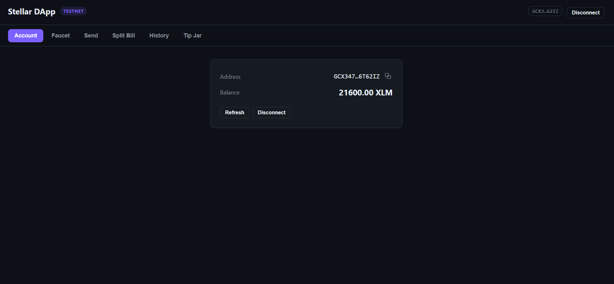
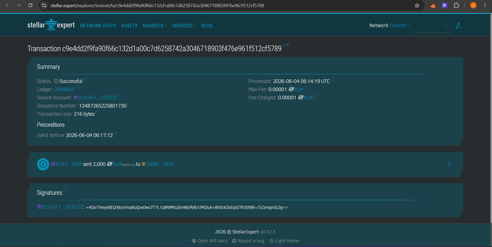
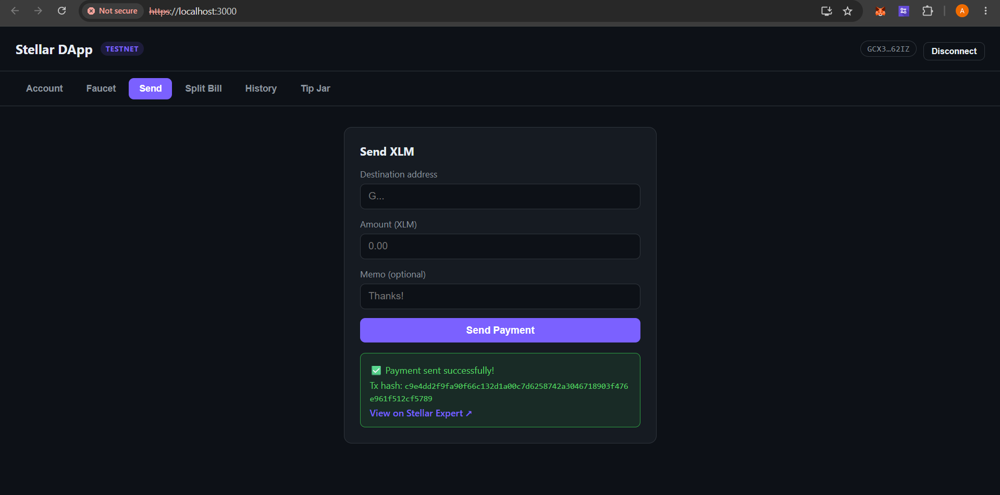

# Stellar DApp — Freighter Wallet Frontend

A React single-page app that connects to the [Freighter](https://www.freighter.app/)
browser wallet and lets you interact with the **Stellar Testnet**: view your
balance, fund your account, send XLM, split a bill across several people, and
browse your recent transactions. It also includes a static Tip Jar page with a
scannable QR code.

> ⚠️ This app runs entirely on the **Stellar Testnet**. No real funds are used.

## Features

- **Wallet connection** — connect and disconnect the Freighter wallet; the
  session is restored automatically on reload while access remains granted.
- **Balance** — fetches and displays the connected wallet's native XLM balance,
  with a manual refresh.
- **Testnet faucet** — request free Testnet XLM in one click via Friendbot.
- **Send XLM** — build, sign (in Freighter), and submit a payment, with success
  / failure feedback and the transaction hash.
- **Split bill** — split a total equally and pay each participant their share,
  with per-recipient status.
- **Transaction history** — recent payments for the connected wallet, labelled
  sent / received, each linking to the block explorer.
- **Tip Jar** — a static donation page with a QR code (SEP-0007 pay URI).
- **Section navigation** — each utility lives in its own navigable section.

## Tech stack

- [React](https://react.dev/) (Create React App)
- [`@stellar/freighter-api`](https://www.npmjs.com/package/@stellar/freighter-api) — wallet integration
- [`@stellar/stellar-sdk`](https://www.npmjs.com/package/@stellar/stellar-sdk) — building/submitting transactions via Horizon
- [`qrcode.react`](https://www.npmjs.com/package/qrcode.react) — Tip Jar QR code

## Prerequisites

- **Node.js 18+** and npm
- The **[Freighter](https://www.freighter.app/) browser extension**, set to the
  **Test Net** network (open Freighter → Settings → Network → *Test Net*)

## Setup (run locally)

```bash
# 1. Install dependencies
npm install

# 2. Start the dev server (HTTPS — Freighter requires a secure origin)
npm start
```

The app opens at **https://localhost:3000**. Because it is served over HTTPS
with a self-signed certificate, your browser will show a one-time warning —
accept it to continue.

### Funding a Testnet account

After connecting, open the **Faucet** section and click *Request 10,000 XLM*, or
use Friendbot directly:

```
https://friendbot.stellar.org/?addr=<YOUR_PUBLIC_KEY>
```

### Other scripts

```bash
npm test         # run the test suite
npm run build    # production build into ./build
```

## How it works

- All network calls target Testnet: Horizon at
  `https://horizon-testnet.stellar.org` and the `TESTNET` network passphrase
  (see [`src/components/Freighter.js`](src/components/Freighter.js)).
- Wallet/connection state is shared app-wide via a React context
  ([`src/components/WalletContext.js`](src/components/WalletContext.js)), so it
  persists as you navigate between sections.
- Transactions are built with the Stellar SDK, signed by Freighter, and
  submitted to Horizon; the resulting hash links to
  [Stellar Expert](https://stellar.expert/explorer/testnet).

## Screenshots

> Screenshots live in [`screenshots/`](screenshots/). Replace the placeholder
> files with your own captures (PNG) using the filenames below.

### Wallet connected state
The wallet is connected and the account address is shown.



### Balance displayed
The connected wallet's XLM balance shown in the Account section.


### Sending a Testnet transaction
Filling in the recipient and amount, then signing in Freighter.



### Transaction result shown to the user
Success feedback with the transaction hash and an explorer link.



## Project structure

```
src/
├── App.js                        # Wraps the app in the wallet provider
├── components/
│   ├── WalletContext.js          # Shared connection state (connect, balance, ...)
│   ├── Shell.js                  # App bar + section navigation
│   ├── Account.js                # Address, balance, copy, disconnect
│   ├── Faucet.js                 # Friendbot funding
│   ├── SendTransaction.js        # Send XLM + result feedback
│   ├── SplitBill.js              # Split a total and pay each share
│   ├── TransactionHistory.js     # Recent payments
│   ├── TipJar.js                 # Static donation page with QR code
│   └── Freighter.js              # Stellar/Freighter service layer (Testnet)
└── App.css                       # Styles
```
